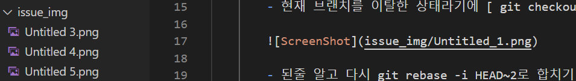

# export

생성 일시: 2023년 1월 27일 오후 6:38
최종 편집 일시: 2023년 1월 27일 오후 6:58

- 노션문서 github 업로드시 이미지 깨짐(해결)
    - 이미지가 있는 문서를 export시 zip파일이 나온다
    - 이미지 파일이 모인 폴더와 텍스트만 모아둔 md파일을 github에 그냥 올린다면 텍스트는 정상으로 나오고 이미지 파일은 깨져서 나오게 된다
    - github에 이미지 폴더를 따로 만들어 거기에 모아둔 후 md파일 안에서 사용하고자 하는 이미지 위치에 해당 이미지 경로를 넣어준다
    
    